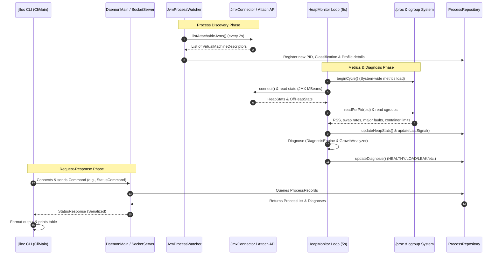
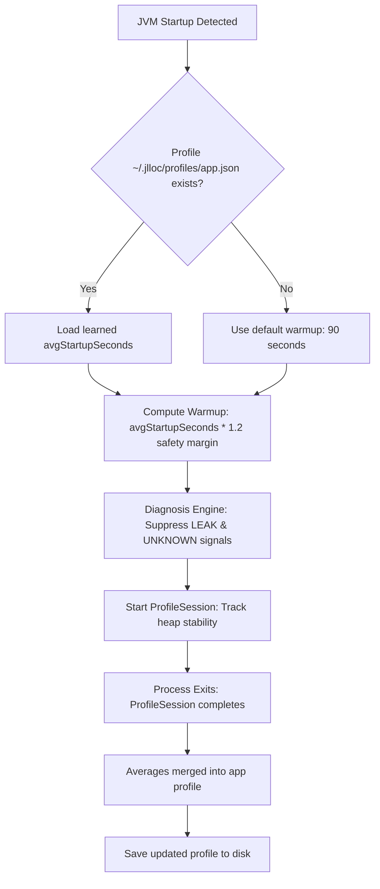

# Architecture and End-to-End Control Flow

This document details the architectural layout, class structure, end-to-end control flow, and core design principles behind `jlloc`.

---

## 1. Project Motivation and High-Level Design

At local development scale, running a microservice environment (e.g., multiple Spring Boot applications, Elasticsearch, Kafka, ActiveMQ) on a single workstation often leads to machine exhaust or OutOfMemory (OOM) crashes. Developers typically struggle to tune `-Xmx` sizes manually, or suffer from silent OOM kills inside containers without a clear diagnosis.

`jlloc` targets **zero-config**, automatic JVM monitoring and management by:
1. **Detecting** all JVM processes running on a host via JDK's Attach API.
2. **Classifying** processes using a data-driven fingerprinting directory (`fingerprints.json`).
3. **Collecting** three-axis memory indicators:
   - **Layer 1 (JVM):** Heap usage, GC frequency, GC CPU time, off-heap space (Metaspace, Direct Buffer pools, JIT code cache) via JMX.
   - **Layer 2 (OS):** Resident Set Size (RSS), minor/major page fault rates, and system-wide disk Swap In/Out rates via `/proc` (on Linux) or OSHI.
   - **Layer 3 (Container):** cgroup memory limits and memory pressure inside container runtimes (Linux cgroups v1 & v2).
4. **Diagnosing** behavior (Healthy vs. Load vs. Leak vs. Host Memory Pressure vs. Startup Warmup) using noise-resistant algorithms like Ordinary Least Squares (OLS) regression over historical minimum post-GC floors.
5. **Recommending and Exposing** scaling intent via metrics so existing tooling can act on it, or recommending container limit adjustments.

---

## 2. Repo Layout and Module Architecture

`jlloc` is structured as a Java multi-module Gradle project targetting **Java 21**:

```
jlloc (root)
 ├── jlloc-common    [Java] : Shared record models and Object-Stream commands/responses.
 ├── jlloc-daemon    [Java] : Core background engine; watches JVMs, polls stats, runs diagnosis.
 ├── jlloc-agent     [Java] : Startup/attach instrumentation agent (-javaagent).
 ├── jlloc-cli       [Java] : Developer console frontend (CLI) with user-friendly formatting.
 ├── jlloc-native    [C++]  : Low-level JVMTI agent utility hooks (for later phases).
 └── jlloc-wrapper   [Bash] : Drop-in wrapper around the standard `java` command.
```

---

## 3. Class-by-Class Breakdown

### `jlloc-common` (Communication Protocol)
* **`HeapBudget`**: Shared record detailing the allocated maximum heap size (`maxHeapBytes`) and the rationale behind that budget.
* **`Command` / `Response`**: Sealed Java interface hierarchies representing CLI-to-Daemon messages. Using `sealed` interfaces enables the compiler to enforce exhaustive switch matching.
  - Commands: `StatusCommand` (get system snapshot), `ExplainCommand` (get detailed process stats), `DumpCommand` (request `.hprof`), `FixCommand` (resize heap request).
  - Responses: `StatusResponse`, `ExplainResponse`, `DumpResponse`, `FixResponse`, `ErrorResponse`.
* **`ProcessSummary`**: A flat data structure containing metrics, status, and diagnostic signals (e.g., `leakSignal`, `gcPressureSignal`) for a single VM, which the CLI uses to draw status tables.

### `jlloc-agent` (Agent Payload)
* **`AgentMain`**: The entry point for the JVM instrumentation. Exposes `premain` (load at startup via `-javaagent`) and `agentmain` (load into a running JVM via the Attach API).

### `jlloc-cli` (Console UI)
* **`CliMain`**: Entry point for command parsing. Finds the daemon port from `~/.jlloc/daemon.port`, opens a socket connection, serializes a `Command` using Java object serialization, reads the `Response`, and prints formatted tables or diagnostic blocks (e.g., `formatStatus`, `formatExplain`).

### `jlloc-daemon` (Deep Diagnostics Engine)
* **`DaemonMain`**: Initializes daemon sub-services, handles process registry state machine transitions (Startup/Shutdown events), and schedules periodic console status printing (every 30 seconds).
* **`JvmProcessWatcher`**: Discovers attachable JVMs on the host machine using the Attach API. Runs a 2-second scheduled loop, maintaining a thread-safe `ConcurrentHashMap` of registered JVMs. Emits callbacks for newly started/stopped PIDs.
* **`ProcessFingerprinter` & `FingerprintRegistry`**: Reads rules from `fingerprints.json` (ID, Matchers, Priority Weight, Category) and maps a raw `DetectedJvm` to a category (e.g., `application`, `database`, `search-engine`) and priority. If names are ambiguous (like `JarLauncher`), it attaches and inspects system properties (e.g., `spring.application.name`, `sun.java.command`).
* **`ProcessRepository`**: Thread-safe in-memory registry (`ConcurrentHashMap<Long, ProcessRecord>`) that tracks the complete, merged picture of monitored PIDs.
* **`JmxConnector`**: Attaches to target JVM PIDs on demand, forces a dynamic local management agent launch (if not already started) via `vm.startLocalManagementAgent()`, queries MBeans (`java.lang:type=Memory`, `MemoryPool`, `BufferPool`, `GarbageCollector`), and extracts heap, off-heap, and GC time totals.
* **`HeapMonitor`**: Scheduled loop running every 5 seconds. Polls stats for active VMs, appends data to historical timelines, calls `MemorySignalExtractor` and `DiagnosisEngine`, and triggers warnings/alerts on worsening severity.
* **`HeapSample`**: A timestamped, immutable record representing one GC counter and heap usage state.
* **`HeapTimeline`**: Rolling, in-memory repository of `HeapSample`s capped to a 30-minute window (max 360 samples) per PID.
* **`MemorySignal`**: Aggregated memory features across all three layers (JVM, OS, container) representing a single point-in-time state.
* **`MemorySignalExtractor`**: Aggregates JVM facts, queries cgroups, reads `/proc` files, and delegates details to sub-extractors.
* **`OsMemorySignalExtractor`**: Reads CPU/RAM statistics from `/proc/<pid>/status`, `/proc/<pid>/stat`, `/proc/vmstat`, and `/proc/stat`. Computes system-wide swap rates and CPU I/O waits once per cycle, ensuring rate calculations are uniform and noise-free.
* **`ContainerSignalExtractor`**: Parses Linux cgroup limit files (`memory.limit_in_bytes` / `memory.max`) to determine resource limits and estimate pod pressure.
* **`GcPressureCalculator`**: Evaluates the percentage of wall-clock time spent in garbage collection. High values suggest the JVM is thrashed and near an OOM failure.
* **`HeapGrowthAnalyzer`**: Isolates post-GC heap minimum boundaries, fits Ordinary Least Squares (OLS) regression lines to calculate rates of heap memory leakage, and tracks application GC allocation rates.
* **`DiagnosisEngine`**: Implements the main heuristics. Separates severity (NORMAL, WARNING, CRITICAL) from classification (HEALTHY, LOAD, LEAK, HOST_MEMORY_PRESSURE, WARMUP).
* **`RecommendationEngine` & `RecommendationId`**: Suggests remediation strategies (e.g., `TAKE_HEAP_DUMP`, `INCREASE_XMX`, `DECREASE_XMX`, `INCREASE_CONTAINER_MEMORY`, `EMERGENCY_REDUCE_FOOTPRINT`) based on target diagnosed states.
* **`DiagnosisFormatter`**: Formats output strings (like `ExplainBlock`) sent over the socket to the CLI representation.
* **`ProfileStore`, `ProfileSession`, and `MemoryProfile`**: Measures startup metrics (stabilization duration, peak memory) for each app type, writing historical profiles to `~/.jlloc/profiles/<appName>.json` when services terminate, which helps initialize future Warmup windows.
* **`DaemonSocketServer`**: Binds to a random port, registers that port in `~/.jlloc/daemon.port`, and processes incoming Java serialized commands.
* **`CheckpointInfo`**: Stub record defining CRaC state (checkpoint file locations, target restore limits).

---

## 4. End-to-End Control Flow



### Detailed Event Pipelines:

#### A. Process Discovery & Startup (Periodic: 2 seconds)
1. `JvmProcessWatcher` polls running JVMs on the host via `VirtualMachine.list()`.
2. Self-processes (the `jlloc-daemon` itself and the short-lived `jlloc-cli` processes) are identified by PID or display name and filtered out.
3. Newly detected JVMs trigger the `onJvmStarted` callback registered in `DaemonMain`:
   - An entry is initialized in the thread-safe `ProcessRepository`.
   - The `ProcessFingerprinter` executes a fast, name-based classification check against the rules declared in `fingerprints.json`.
   - If the name is ambiguous (e.g., matching a generic name like `"JarLauncher"` or returning `"unknown"`), the fingerprinter executes a deep inspection. It attaches to the target process using the JDK Attach API, retrieves its system properties, and maps them to markers like `spring.application.name` or `sun.java.command`.
   - `JmxConnector.probeCapabilities` evaluates connection requirements, attempting to dynamic-launch the local JMX management agent via `VirtualMachine.startLocalManagementAgent()`.
   - The daemon checks the local configuration storage for learned historical profile data (`~/.jlloc/profiles/<appName>.json`) and caches it in the process record.

#### B. Monitoring & Diagnosis Loop (Periodic: 5 seconds)
1. At the beginning of the scheduled poll cycle, `HeapMonitor` calls `MemorySignalExtractor.beginCycle()`. This instructs the `OsMemorySignalExtractor` to query machine-wide parameters—such as swapping rates (`/proc/vmstat`) and CPU metrics (`/proc/stat`)—exactly once per cycle. Caching these coordinates guarantees uniform rate computations across all JVM targets and prevents collapsing calculation interval denominators.
2. For each active JVM in `ProcessRepository`:
   - `JmxConnector` connects to the target virtual machine and polls JMX MBeans (`java.lang:type=Memory`, `MemoryPool`, `GarbageCollector`) to extract GC metrics, JVM heap thresholds (committed, max, used), and off-heap allocations.
   - `HeapTimeline` registers a new `HeapSample`.
   - `MemorySignalExtractor` merges these JMX statistics with OS-level telemetry (RSS and major page faults from `/proc/<pid>/status` and `/proc/<pid>/stat`) and container constraints (from `/sys/fs/cgroup`).
   - `HeapGrowthAnalyzer` evaluates the sample list:
     - Identifies GC boundaries by watching for cumulative `gcCount` updates.
     - Tracks minimum heap usage inside each GC boundary to produce the `PostGcFloor` sequence.
     - Runs Ordinary Least Squares (OLS) regression over the floor sequence to solve for the growth trend slope in bytes per second.
     - Calculates the allocation rate based on heap usage increases between samples where `gcCount` remains constant.
   - `GcPressureCalculator` computes CPU time consumed during garbage collection.
   - `DiagnosisEngine` executes the diagnostic rules:
     - **Severity Axis First (Urgency Checks):** Flags as `CRITICAL` if swap thrashing occurs, container memory pressure exceeds 92%, GC CPU exceeds 80%, or heap usage exceeds 97%. Flags as `WARNING` if container pressure exceeds 80%, GC CPU exceeds 40%, or heap exceeds 80%.
     - **Diagnosis Axis Second (Root Cause Identification):** Overrides to `HOST_MEMORY_PRESSURE` if host swap/cgroup constraints are violated. Otherwise, evaluates signal metrics: if leak and load signals are low (<15), flags as `HEALTHY`. If signals are conflicting/ambiguous (within 15 points), flags as `UNKNOWN`. If leak > load, flags as `LEAK`. If load > leak and heap usage exceeds 75%, flags as `LOAD`.
     - **Startup Warmup override:** If the application is inside its warmup window (learned average startup duration * 1.2), any `LEAK` or `UNKNOWN` diagnosis is downgraded to `WARMUP`.
   - The diagnosis result is updated in `ProcessRepository`.
   - If the severity increases, `HeapMonitor` fires an `AlertEvent` calling `DaemonMain.printAlert()`.

#### C. Command Dispatch (CLI Request)
1. The developer executes a command (e.g., `jlloc status` or `jlloc explain customer-service`).
2. `CliMain` reads the port number from `~/.jlloc/daemon.port` and opens a TCP socket connection to `127.0.0.1`.
3. The CLI serializes a `Command` object using Java's Object Serialization and transmits it.
4. `DaemonSocketServer` deserializes the command, routes it to the repository or triggers operations (e.g., building diagnostic signals or firing a heap dump via `jcmd`), and returns serialized `Response` records.
5. The CLI reads the response, formats it, and prints the outputs to standard out.

---

## 5. Key Intuitions & Concepts

### A. Distinguishing Load vs. Leak (The "GC Floor" Intuition)
- **Problem:** When an application is running, its heap usage naturally trends upwards as it processes requests. Simply measuring `heapUsed %` can flag active, healthy apps under load as leaking.
- **Solution:** `jlloc` tracks the *floor* of heap usage. When a Java garbage collector runs, it reclaims all dead objects. The heap usage immediately following a collection is the absolute minimum memory needed to run the app.
  - **Load Sawtooth Pattern:** The floor remains flat, despite spikes in heap usage. This implies GC successfully reclaims transient objects.
  - **Leak Trend:** The floor climbs higher after successive GC cycles. Since GC is running but cannot reclaim this memory, objects are leaking.
- **Noise Resistance (OLS Regression):** Streaks of rising floors are error-prone due to temporary caches or delayed GC cycles. `jlloc` calculates a linear regression slope over the floor sequence. This filters out temporary fluctuations and yields a reliable metric (bytes/sec) to gauge growth.

### B. "Swap Death" (Thrashing Rates vs. Static Usage)
- **Problem:** OS monitors often alert when disk swap usage is high. However, if swap memory is occupied by dormant classes or pages that are never accessed, the system remains healthy.
- **Solution:** `jlloc` ignores swap space volume. It monitors **Swap In/Out rates (pages/sec)**.
  - If a system has a high swap-in rate (`pswpin` increases) coupled with high major page faults, it is thrashing. JVM threads are blocking on disk reads to execute instructions, causing the application to hang. `jlloc` flags this as `EMERGENCY_REDUCE_FOOTPRINT` before the JVM crashes.

### C. Off-Heap Starvation inside Containers (Counter-Intuitive Resizing)
- **Problem:** In container workloads (Kubernetes, Docker), pods get OOM-killed without the JVM raising an exception. High off-heap allocations (Metaspace, Direct Byte Buffers, native bindings) run the process over cgroup limits while JVM heap metrics look normal.
- **Solution:** `jlloc` integrates host and cgroup statistics with JVM telemetry.
  - If total RSS memory approaches container maximums, but JVM heap remains low, increasing `-Xmx` will worsen the problem. `jlloc` generates a counter-intuitive recommendation: **Decrease `-Xmx`**. This constrains heap space, allocating more room to the JVM's off-heap components (like Netty buffer pools) and preventing OOM kills.

---

## 6. IPC Protocol and Socket Transport Mechanics

Communication between the `jlloc-cli` frontend and `jlloc-daemon` backend is built on a direct loopback socket protocol:

### A. Port Discovery
To prevent port mapping conflicts with developers' local workloads, the daemon binds to an ephemeral OS-assigned port `0` at bootstrap. Once bound, it writes the active port number to a secure dotfile at `~/.jlloc/daemon.port`. When client CLI commands are invoked, `CliMain` reads the port from this file and targets the loopback adapter (`127.0.0.1`).

### B. Transport and Serialization
Commands and responses are serialized using standard Java Object Serialization over TCP sockets. The protocol contracts are governed by sealed Java interface hierarchies defined in `jlloc-common`:
- **`Command`**: Sealed interface containing implementations such as `StatusCommand`, `ExplainCommand`, `DumpCommand`, and `FixCommand`.
- **`Response`**: Sealed interface containing implementations such as `StatusResponse`, `ExplainResponse`, `DumpResponse`, `FixResponse`, and `ErrorResponse`.

### C. Security Posture & Vulnerabilities
- **Gadget Chains Risk:** Java Object Serialization is vulnerable to Remote Code Execution (RCE) attacks if untrusted bytecode payloads are transmitted. 
- **Mitigation:** Access is locked down by binding the daemon socket strictly to `127.0.0.1`. This restricts socket connections only to processes running on the local host.
- **Planned Improvements:** 
  1. Transitioning the protocol to structured JSON/Protobuf APIs.
  2. Registering explicit deserialization whitelists via JDK's `ObjectInputFilter`.
  3. Generating a cryptographic verification token in `~/.jlloc/daemon.token` at startup that CLI clients must supply to authenticate connection sessions.

---

## 7. Process Fingerprinting & Classification Hierarchy

`jlloc` relies on a declarative fingerprinting directory (`fingerprints.json`) to classify running JVM processes. 

### A. fingerprints.json Properties
The fingerprints database resides on the classpath as `src/main/resources/fingerprints.json` and contains:
- `version`: Checked against `SUPPORTED_SCHEMA_VERSION = 1` during loading to prevent misinterpreting newer configuration layouts.
- `fingerprints`: An array of classification documents containing an `id` (e.g., `spring-boot`, `elasticsearch`), a `category` (e.g., `application`, `database`, `search-engine`, `build-tool`), a `priorityWeight` (used by the heap budget allocator), and match parameters.

### B. Resolution Matching Sequence
1. **Shallow File and Classpath Matching:** The daemon loops through active JVM descriptors. Using the display name returned by `VirtualMachine.list()`, it tests against the `nameContains` array of each rule using the match style defined by the rule's `MatchType`:
   - `CONTAINS`: Substring comparison.
   - `EQUALS`: Direct string equivalence.
   - `PREFIX`: Matches the beginning of the string.
   - `SUFFIX`: Matches the end of the string.
   - `REGEX`: Regular expression pattern matching (case-sensitive on raw command representation).
2. **Deep Inspection (Attach API Call):** If shallow checks yield `"unknown"` or match generic JVM wrappers (like `JarLauncher`), the daemon accesses the VM using its PID:
   ```java
   VirtualMachine vm = VirtualMachine.attach(String.valueOf(pid));
   Properties systemProperties = vm.getSystemProperties();
   ```
   The engine then scans for specific property markers (like `spring.application.name` or `es.path.home`). If matched, it extracts the target application name. If no explicit markers are found, it falls back to parsing `sun.java.command` and normalizes the command path to extract the executable name.

---

## 8. Mathematical Heuristics & Diagnosis Formulas

### A. Post-GC Floor slope Estimation (Ordinary Least Squares)
To compute the heap growth rate while ignoring normal transaction cycles, `HeapGrowthAnalyzer` filters out post-GC heap minimums and fits a linear regression line.

Let $S = \langle (t_0, y_0), (t_1, y_1), \dots, (t_{n-1}, y_{n-1}) 
angle$ be the post-GC floor sequence, where:
- $t_i$ represents the timestamp of the floor measurement.
- $y_i$ represents the heap memory footprint minimum in bytes.

For OLS computation, the time axis is normalized relative to the initial sample:
$$x_i = rac{t_i - t_0}{1000} 	ext{ (seconds)}$$

The regression line is modeled as $y = mx + c$. The slope parameter $m$ (bytes per second) is solved using:
$$m = rac{n \sum_{i=0}^{n-1} (x_i y_i) - \left(\sum_{i=0}^{n-1} x_i
ight) \left(\sum_{i=0}^{n-1} y_i
ight)}{n \sum_{i=0}^{n-1} x_i^2 - \left(\sum_{i=0}^{n-1} x_i
ight)^2}$$

- **Data Threshold:** Computations require $n \geq 3$ to prevent calculation errors over sparse data.
- **Leak Indicator:** An OLS slope slope $m > 50,000 	ext{ B/s}$ ($50 	ext{ KB/s}$) is flagged as a rising floor.

### B. Allocation Rate Computation
The allocation rate represents the memory allocations performed by threads, calculated by tracking heap increases while filtering out GC collections.

For each sample pair $(s_{i-1}, s_i)$ where $s_i.gcCount = s_{i-1}.gcCount$:
$$\Delta y_i = \max(0, s_i.usedBytes - s_{i-1}.usedBytes)$$

The allocation rate (bytes per second) across the entire timeline window is:
$$	ext{AllocationRate} = rac{\sum_{i=1}^{k} \Delta y_i}{t_{	ext{last}} - t_{	ext{first}}}$$

- **High Allocation Threshold:** Allocations $> 5,000,000 	ext{ B/s}$ ($5 	ext{ MB/s}$) indicate heavy transactional workloads.
- **Low Allocation Threshold:** Allocations $< 500,000 	ext{ B/s}$ ($500 	ext{ KB/s}$) suggest idle state.

### C. GC CPU Time Ratio (GC Pressure)
The GC CPU ratio measures the time JVM threads spend in garbage collection:
$$	ext{GcTimeRatio} = rac{	ext{Accumulated GC Elapsed Time}_t - 	ext{Accumulated GC Elapsed Time}_{t-\Delta}}{\Delta 	imes 	ext{Available Processors}}$$

- **Severity Thresholds:** GC ratio $\geq 0.80$ ($80\%$) triggers `CRITICAL` severity (OOM imminent). GC ratio $\geq 0.40$ ($40\%$) triggers `WARNING`.

### D. OS Swap Thrashing Index
Swap thrashing is diagnosed by cross-referencing host page swaps with process-specific major page faults. Page sizes default to Linux standard page sizing ($4096 	ext{ bytes}$).

Let $pswpin$ and $pswpout$ be cumulative OS swapped pages from `/proc/vmstat`. Let $majflt$ be the process's cumulative major page faults from `/proc/<pid>/stat`.
$$	ext{SwapInRate} = rac{\Delta pswpin 	imes 4096}{\Delta t} 	ext{ (bytes/sec)}$$
$$	ext{SwapOutRate} = rac{\Delta pswpout 	imes 4096}{\Delta t} 	ext{ (bytes/sec)}$$
$$	ext{MajorFaultRate} = rac{\Delta majflt}{\Delta t} 	ext{ (faults/sec)}$$

- **Thrashing Criteria:** Thrashing is flagged active when:
  $$(	ext{SwapInRate} > 1,000,000 	ext{ B/s} \lor 	ext{SwapOutRate} > 1,000,000 	ext{ B/s}) \land 	ext{MajorFaultRate} > 10 	ext{ faults/s}$$
  *This condition immediately escalates process severity to `CRITICAL`.*

### E. Container Memory Pressure
Container relative pressure measures the total host footprint (RSS) against container maximum limits:
$$	ext{ContainerPressure} = rac{	ext{VmRSS from } /proc/\langle pid
angle/status}{	ext{Cgroup Memory Limit}}$$
- Cgroup limits are sourced from `/sys/fs/cgroup/memory.max` (cgroups v2) or `/sys/fs/cgroup/memory/memory.limit_in_bytes` (cgroups v1).
- **Severity Thresholds:** Pressure $\geq 0.92$ triggers `CRITICAL`. Pressure $\geq 0.80$ triggers `WARNING`.

---

## 9. Warmup Heuristics and File-Based Profile Learning

To prevent false leak alarms during application startup (such as class loading, compilation optimizations, and database pools initialization), `jlloc` implements file-based profile learning:



### A. Learning Stabilization
When a JVM process starts monitoring, a `ProfileSession` is instantiated. The session records memory samples isDiagStable and tracks when the growth trajectory levels out. When the target PID exits, `HeapMonitor.forgetPid` is invoked.

### B. Profile Merging and Persistence
The system retrieves the app's current configuration template from `~/.jlloc/profiles/<appName>.json`. The details are merged:
- Increment `observedSessions`.
- Recompute the rolling average startup time:
  $$	ext{NewAvgStartup} = rac{(	ext{PriorAvg} 	imes 	ext{PriorSessions}) + 	ext{SessionStartupTime}}{	ext{PriorSessions} + 1}$$
The updated json payload is saved to disk, providing personalized warmup windows for subsequent app launches.

---

## 10. Step-by-Step Monitored JVM Lifecycle Example

This walkthrough traces the lifecycle of a hypothetical Spring Boot service, `customer-service`, running inside a container.

```mermaid
sequenceDiagram
    autonumber
    participant App as customer-service (PID 8820)
    participant Watcher as JvmProcessWatcher
    participant Monitor as HeapMonitor (5s Loop)
    participant OLS as HeapGrowthAnalyzer
    participant Engine as DiagnosisEngine
    participant Client as Developer CLI (jlloc)

    Note over App, Watcher: Phase 1: Execution & Classification
    App->>App: Boots (Local Management JMX Agent active)
    Watcher->>Watcher: Scans local PIDs (listAttachableJvms)
    Watcher->>App: Detects PID 8820
    Watcher->>App: Attaches to PID 8820 & reads spring.application.name
    Watcher->>Monitor: Classifies as appName=customer-service (Weight 20)
    Monitor->>Monitor: Loads profiles/customer-service.json (Avg Startup: 50s)
    Monitor->>Monitor: Sets Warmup Window to 60s (50s * 1.2 margin)

    Note over App, Monitor: Phase 2: Warmup Window (Uptime < 60s)
    Monitor->>App: Polls JMX Heap stats (used=350MB, max=512MB)
    Monitor->>OLS: Evaluates 10 floors (slope = +4 MB/s)
    Monitor->>Engine: Evaluates signals
    Engine-->>Monitor: Diagnosis: WARMUP (LEAK signal suppressed)
    Monitor-->>Monitor: Severity: NORMAL (Uptime: 30s)

    Note over App, Monitor: Phase 3: Stabilization & Normal State (Uptime > 60s)
    App->>App: Startup complete. GC reclaims dead setup instances
    Monitor->>App: Polls stats (used=210MB, max=512MB)
    Monitor->>OLS: Sequence floors stable (slope = -2 KB/s)
    Monitor->>Engine: Evaluates signals
    Engine-->>Monitor: Diagnosis: HEALTHY, Severity: NORMAL

    Note over App, Engine: Phase 4: Active Memory Leak Occurs
    App->>App: Leak route triggered (retains static data structures)
    Monitor->>App: Polls stats (used=380MB, max=512MB)
    Monitor->>OLS: GC count increases, but floors rise: 210MB -> 250MB -> 290MB -> 330MB
    OLS-->>Monitor: OLS Regression calculates slope = +150 KB/s (exceeds 50KB/s)
    Monitor->>Engine: Evaluates signals (low allocation, rising floor)
    Engine-->>Monitor: Diagnosis: LEAK, Severity: WARNING (Heap used > 80%)
    Note over Monitor: Alert triggers stdout notification

    Note over Client, Monitor: Phase 5: Developer Diagnostics Query
    Client->>Monitor: jlloc explain customer-service
    Monitor-->>Client: Returns ExplainResponse (LEAK/WARNING + Recommended dump command)
    Client->>Client: Displays detailed telemetry table to shell

    Note over App, Engine: Phase 6: Critical Escalation (No Action Taken)
    App->>App: Leak continues. Heap consumed reaches 505MB (98% of -Xmx)
    App->>App: GC thrashing (CPU spent in GC exceeds 85%)
    Monitor->>Engine: Evaluates signals
    Engine-->>Monitor: Severity: CRITICAL, Recommendation: TAKE_HEAP_DUMP
    Note over Monitor: Prints emergency console alert

    Note over Client, App: Phase 7: Resolution Command
    Client->>Monitor: jlloc dump customer-service
    Monitor->>App: Executes jcmd 8820 GC.heap_dump
    App-->>Monitor: Writes customer-service.hprof to disk
    Monitor-->>Client: Returns success (Ready for Eclipse MAT analysis)
